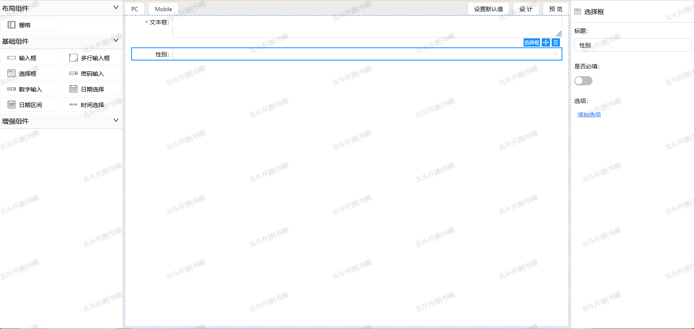

### Triones表单设计器

Triones from designer 是一款表单设计器，支持PC端和移动端。当前有react版本，后续会开发vue版本


演示地址：https://trionesdev.github.io/triones-form-designer/

---

### 说明

项目设计思路，大量借鉴了 [designable](https://github.com/alibaba/designable) ，另外由于designable已经不再维护，
我们提供了支持antd v5的designable修复版本 [triones-designable](https://github.com/trionesdev/triones-designable)

### 特性

- 基于formilyjs 表单解决方案 [formilyjs](https://formilyjs.org/zh-CN)
- 支持基于formilyjs 封装的各种组件库

### 使用

1. 安装

```shell
  pnpm add @trionesdev/form-designer-react
```

2. 页面使用

```typescript jsx
function App() {
    const [data, setData] = useState<any>({});

    const handleSetData = () => {
        setData({
            'x-id': 'td_tXAABwaZAE',
            type: 'object',
            'x-component-name': 'Form',
            properties: {
                td_rszikvOzVh: {
                    type: 'string',
                    title: '文本框',
                    required: true,
                    'x-decorator': 'FormItem',
                    'x-component': 'Input.TextArea',
                    'x-id': 'td_rszikvOzVh',
                    'x-index': 0,
                    'x-component-name': 'Field',
                },
                td_AaMFjiFfps: {
                    title: '性别',
                    type: 'number',
                    'x-decorator': 'FormItem',
                    'x-component': 'Select',
                    'x-id': 'td_AaMFjiFfps',
                    'x-index': 1,
                    'x-component-name': 'Field',
                },
            },
        });
    };

    const handleOnChange = (value: any) => {
        console.log('[TreeInfo]value', value);
    };

    GlobalStore.registerIcons(icons);
    return (
        <div className="App">
            <Watermark style={{ height: '100%' }} content={['北斗开源|书阙']}>
                <FormDesigner
                    value={data}
                    onChange={(value) => {
                        handleOnChange(value);
                        setData(value);
                    }}
                    onItemDelete={(item) => {
                        Modal.confirm({
                            title: '确定删除该项吗？',
                            onOk: () => {
                                item.remove();
                            },
                        });
                    }}
                    beforeItemDelete={(item) => {
                        console.log(item);
                        if (item.schema['x-component'] === 'InputNumber') {
                            message.error('InputNumber 组件不能被删除');
                            return false;
                        }
                        return true;
                    }}
                >
                    <StudioPanel>
                        <CompositePanel style={{ width: 300 }}>
                            <ResourceWidget title={`布局组件`} sources={[FormGrid]} />
                            <ResourceWidget
                                title={`基础组件`}
                                sources={[Input, Select, Password, InputNumber]}
                            />
                        </CompositePanel>
                        <WorkspacePanel>
                            <div>
                                <DesignerTools onSetDefaultData={handleSetData} />
                            </div>
                            <ViewportPanel>
                                <ViewPanel type={'DESIGNABLE'}>
                                    <ComponentsWidget
                                        components={{
                                            Form,
                                            Field,
                                            Input,
                                            Select,
                                            Password,
                                            InputNumber,
                                            FormGrid,
                                        }}
                                    />
                                </ViewPanel>
                            </ViewportPanel>
                        </WorkspacePanel>
                        <AntdSettingsPanel />
                    </StudioPanel>
                </FormDesigner>
            </Watermark>
        </div>
    );
}
```

详见 [demo](examples/form-designer-react)


3. 组件开发

组件可以自定义，具体开发可以参考 [components](examples/form-designer-react/src/components)
> 自定义的组件开发，基本与常规的Form组件开发一致，满足value,onChange两个必要属性即可。在此基础上，再通过TdFC进行定义层面的封装即可。

预览效果的实现参考： https://react.formilyjs.org/zh-CN/api/shared/map-read-pretty

---
#### 互相吹捧，共同进步

<div style="text-align: center">

</div>
